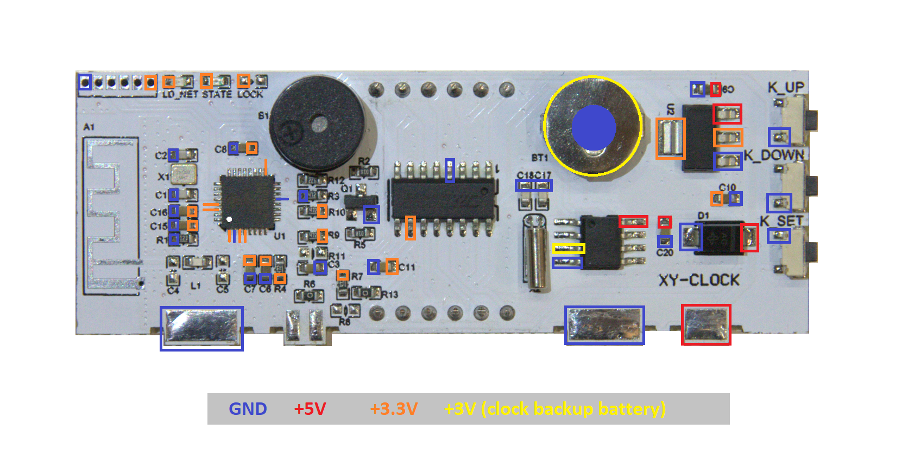

# PCB analysis of the XY_CLOCK

Analyze the XY_CLOCK board.

## First impressions

 - Name: XY_CLOCK or XY_WBT
 - Brand: Sinilink
 - Documentation: [Bluetooth version](http://www.sinilink.com/ins/bluetooth/XY-WBT/XY-WBT-EN.pdf)

## Schematics

Schematics on [easyeda](https://www.easyeda.com/utyf/xy-clock)

## Components

 - U1 : ESP8285 microcontroller
  -- [datasheet](https://www.espressif.com/sites/default/files/documentation/0a-esp8285_datasheet_en.pdf).

 - U2: AMS1117 low dropout voltage regulator
   -- [datasheet](http://www.advanced-monolithic.com/pdf/ds1117.pdf).

 - U?: DS1307 I2C Real-Time Clock
   -- [datasheet](https://eu.mouser.com/datasheet/2/256/DS1307-1513036.pdf).

 - U?: LED drive controller TM1650
   -- [chinese datasheet](https://datasheetspdf.com/pdf-file/840047/TitanMicro/TM1650/1),
   [page](https://components101.com/ics/tm1650-led-driver-ic) with link to datasheet translated to English,

 - display: 8401AW: 0.8" 4 digit common cathode white
   -- close but not correct [8401**C**W](http://www.yitenuo.com/product/display/four/ELF-8401C-D.html) or
   [840**2**AW](http://www.yitenuo.com/product/display/four/ELF-8402.html).
   Looks like [these](https://www.aliexpress.com/item/32945496377.html).

## Power domains

The board is powered via 5V, but it runs on 3V3; the U1 voltage regulator does the conversion.
The timekeeping chip (U3) has a battery as auxiliary power supply. 

## GPIO nets

How does the ESP8285 control the peripherals (I2C chip omitted). 

In words:

 - GPIO0 outputs LD_NET, LED1 (low active)
 - GPIO2 outputs STATE, LED2 (low active)
 - GPIO9 inputs switch K_DOWN (low active)
 - GPIO10 inputs switch K_UP (low active)
 - GPIO16 inputs switch K_SET (low active)
 - GPIO14 external KEY used for Bluetooth module
 - GPIO4 external PIN2 used for Bluetooth module
 - GPIO5 Alarm Buzzer

## GPIO nets (I2C)

How does the ESP8285 control the RTC chip and LED driver. 

In words:
- GPIO12 is "SCL" for TM1650 and DS1307 (not real I2C)
- GPIO13 is "SDA" for TM1650 and DS1307 (not real I2C)

(end)
