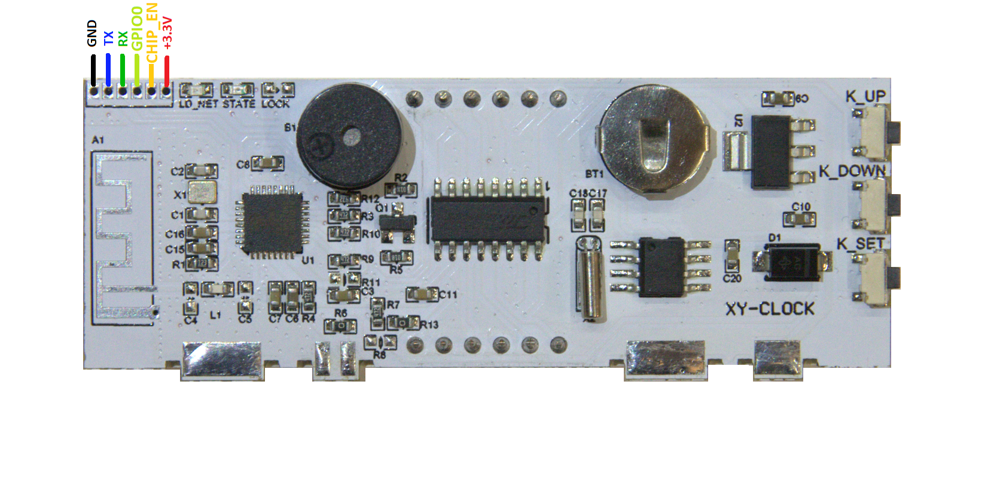

# Firmware backup of the XY_Clock

This page explains how to back up the XY-Clock firmware.

## Introduction

When I tried to make firmware backup I burn my chip :)
GPIO0 configured as output and used for LED1.
If you pull to down GPIO0 when clock working you can burn your MC. Be careful.

Look [303WIFILC01 Clock](https://github.com/maarten-pennings/303WIFILC01)
how to make a backup of an ESP8285.

(end)
