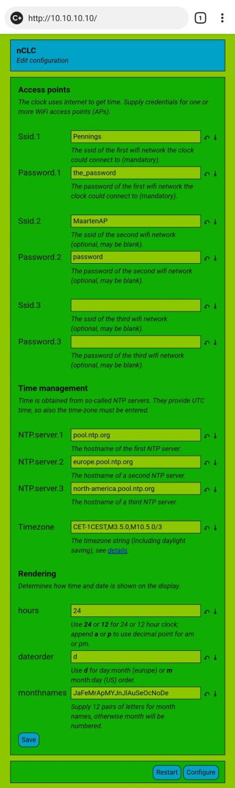

# The new clock firmware

New firmware for the ESP8285 based _XY-clock_.

## Libraries

This sketch relies on two liberties `Cfg` and `Nvm`.
They are available on my GitHub:
 - [Cfg](https://github.com/maarten-pennings/Cfg)
 - [Nvm](https://github.com/maarten-pennings/Nvm)

## nCLC - a basic NTP clock

A basic NTP clock is available in source [nCLC](nCLC).
Features:

 - Pressing button SET brings the clock in configuration mode.
   In configuration mode, it becomes an access point and webserver.
   Via the webserver one can program the SSID/PASSWD of the home network, the **timezone**,
   and how time and date is rendered.
 - During normal operation, pressing DOWN steps the display brightness.
 - During normal operation, pressing UP toggles time and date.

In configuration mode, connect to the access point created by the nCLC,
named something like `nCLC-234C66`, then browse to 10.10.10.10 and start configuring.
The `Timezone` is the hardest field, its syntax is explained
in the [GNU manuals](https://www.gnu.org/software/libc/manual/html_node/TZ-Variable.html).

To upload the binary, use the tool from [step 2](../2-fwbackup)
I had some trouble ("Possible serial noise or corruption.");
it might be wise to lower to `--baud 57600` or even `--baud 9600`.

(end)
