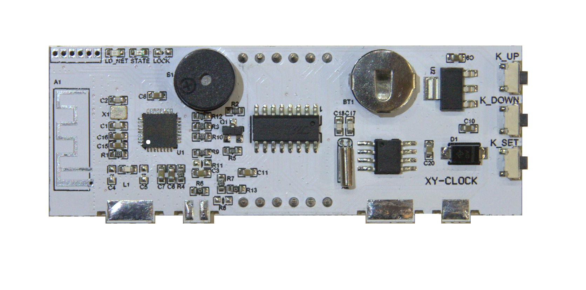

# Sinilink XY-Clock and XY_WBT

Home brew firmware for the ESP8285 based Sinilink XY-Clock WIFI clock.
XY_WBT it version with Bluetooth audio module.
XY-Clock looks like next version of 303WIFILC01 Clock.
This repository based on the [303WIFILC01 Clock](https://github.com/maarten-pennings/303WIFILC01)

Thanks [Maarten Pennings](https://github.com/maarten-pennings)

## 1. Board analysis

I did a first analysis of the board.
Find my findings in subdirectory [1-pcbnets](1-pcbnets/readme.md).

## 2. Backup of original firmware

The goals is to make our firmware and flash that on the board.
But it's better to make a backup of the original firmware, see subdirectory [2-fwbackup](2-fwbackup/readme.md), just in case.

This proves that we can communicate with the internal bootloader, so that we can also upload our own firmware.

## 3. Flashing a test

Let's see if we can flash our own firmware, see subdirectory [3-flash](3-flash/readme.md).

## 4. The display

Time to analyze the display, see subdirectory [4-display](4-display/readme.md).

## 5. The new clock firmware

With the board reverse engineered, it is time to write my own firmware.
A basic NTP clock, see subdirectory [5-clock](5-clock/readme.md).

## 6. The RTC

Test onboard RTC chip DS1307, see subdirectory [6-rtc](6-rtc/readme.md).

## To be continued..

(end)
